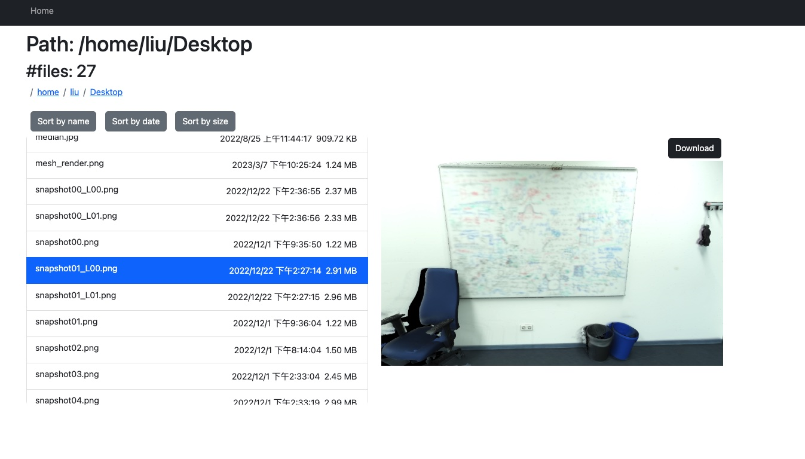

# Web based file browser using vuejs and flask
Use your web browser to navigate the file system. **NOTE:** Use is locally only. Do not expose the server to the internet for safety reason.



## Install

### Client side
1. Install nodejs >= 18
2. Install the npm packages
```
cd client
npm install
```

3. Build the js codes in watch mode. This will automatically rebuild everytime the code has new changes.
```
npm run watch
```


### Server side

1. Create a python env
```
conda install Flask Flask-Cors
cd server
python app.py
```

2. Check 127.0.0.1:8081


